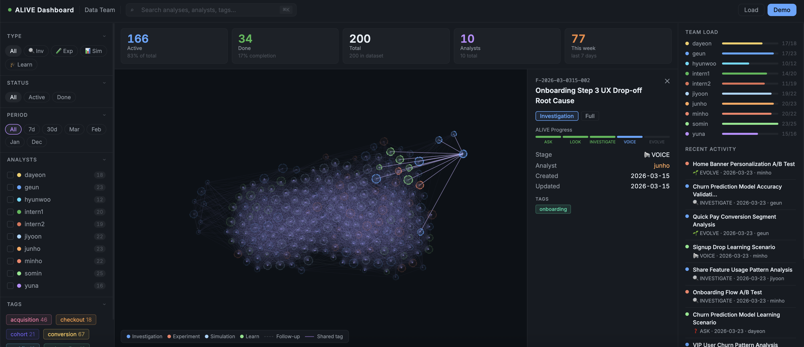

# alive-analysis

**Structured analysis workflow for AI coding agents — every analysis traceable, repeatable, and team-shareable.**

[](CHANGELOG.md)
[](https://www.npmjs.com/package/alive-analysis-mcp)
[](LICENSE)
[](https://claude.ai/code)
[](https://cursor.sh)

---

## Why this exists

You ask Claude to investigate a metric drop. It gives you an answer. You act on it.

Three months later: *"Why did we change that?"* — gone. No reasoning, no data checks, no audit trail.

Or you open a new chat and explain the whole context again from scratch, repeating work that already happened.

**alive-analysis solves this** by turning every analysis into a structured, version-controlled workflow. Claude guides you through a five-stage loop. Each stage produces a markdown file. Everything stays in your repo, searchable by you and by Claude.

The result: a growing knowledge base of how your team thinks, not just what it decided.

---

## How it works

```
You describe a question  →  /analysis-new
                                 ↓
         Claude walks you through 5 stages:
         ASK → LOOK → INVESTIGATE → VOICE → EVOLVE
                                 ↓
              Each stage = one markdown file in analyses/
                                 ↓
         Files are Git-tracked, full-text searchable,
         readable by Claude in future conversations
                                 ↓
         Six months later: /analysis-search "checkout drop"
         → Claude surfaces context, findings, and follow-ups
```

---

## Installation

```bash
# Clone the repo
git clone https://github.com/with-geun/alive-analysis.git /tmp/alive-analysis

# Install — pick your platform
bash /tmp/alive-analysis/install.sh              # Claude Code
bash /tmp/alive-analysis/install.sh --cursor     # Cursor
bash /tmp/alive-analysis/install.sh --both       # Both

# One-time setup — run in your AI agent chat (not the terminal)
/analysis-init    # Configure language, team, data stack, key metrics
/analysis-new     # Start your first analysis
```

That's it. Claude handles the rest.

---

## The ALIVE Loop

Every analysis follows the same five-stage structure. Each stage has a clear purpose, a checklist, and a quality gate before moving forward.

| Stage | Question | Output |
|-------|----------|--------|
| ❓ **ASK** | What do we want to know — and why? | Hypothesis tree, scope, success criteria |
| 👀 **LOOK** | What does the data actually show? | Data quality verdict, SQL templates |
| 🔍 **INVESTIGATE** | Why is it really happening? | Results with confidence levels |
| 📢 **VOICE** | So what — and now what? | Recommendations, audience-specific messages |
| 🌱 **EVOLVE** | What would change the conclusion? | Follow-up analyses, impact tracking |

You never skip a stage without a deliberate choice. The loop enforces analytical discipline — even when you're in a hurry.

---

## Three Modes

### Full Mode — for decisions that matter
Five separate files, one per stage. ~40-item checklists. All specialist agents available. Use this when the decision is high-stakes, when you'll need to explain your reasoning, or when you want the full audit trail.

```
analyses/active/F-2026-0303-001_checkout-drop/
├── 01_ask.md
├── 02_look.md
├── 03_investigate.md
├── 04_voice.md
└── 05_evolve.md
```

### Quick Mode — for fast turnaround
Everything in one file. Compressed checklist. Same ALIVE structure, just lighter. Use this for exploratory questions, morning standups, or anything you need in under an hour. If it grows in scope, `/analysis-promote` converts it to Full automatically.

```
analyses/active/quick_Q-2026-0308-001_dau-check.md
```

### Learn Mode — for building the skill
Guided scenarios with rubric-based scoring, progressive hints, and common-mistake detection. Seven real-world scenarios across two levels. Use this onboard new analysts, practice unfamiliar analysis types, or train interns.

```
analyses/active/L-2026-0220-002_signup-drop-scenario/
```

---

## All Commands

### Core workflow

| Command | What it does |
|---------|-------------|
| `/analysis-init` | One-time setup: language, team name, data stack, key metrics |
| `/analysis-new` | Start a new analysis — choose Full or Quick, set the question |
| `/analysis-next` | Move to the next ALIVE stage with quality gate check |
| `/analysis-status` | Show current stage, checklist progress, open questions |
| `/analysis-archive` | Mark complete, move to `analyses/archive/` |
| `/analysis-list` | Browse all analyses with filters (type, stage, analyst, tags) |
| `/analysis-promote` | Upgrade a Quick analysis to Full when scope expands |

### Finding and reviewing past work

| Command | What it does |
|---------|-------------|
| `/analysis-search` | Full-text search across all analyses — titles, findings, hypotheses |
| `/analysis-retro` | Generate a retrospective report for a period (`--last-month`, `--last-quarter`, `--all`) |
| `/analysis-dashboard` | Export analyses to JSON → load into the visual team dashboard |

### Specialist agents

| Command | What it does |
|---------|-------------|
| `/analysis-agent` | Show which specialist agents are recommended for the current stage |
| `/analysis-agent {number}` | Run a specific agent directly |
| `/analysis-agent "{alias}"` | Run by alias (e.g. `"stats"`, `"causal"`, `"ethics"`) |

### Experiments and monitoring

| Command | What it does |
|---------|-------------|
| `/analysis-new` (Experiment type) | Start an A/B test analysis — adapted ALIVE loop with pre-registration |
| `/monitor-setup` | Configure metric monitoring with alert thresholds |
| `/analysis-new --from-alert {alert-id}` | Escalate a metric alert directly into a new analysis |

### Education mode

| Command | What it does |
|---------|-------------|
| `/analysis-learn` | Start a learning scenario — choose level and scenario |
| `/analysis-learn-next` | Get feedback on your current stage and advance |
| `/analysis-learn-hint` | Request a hint (three levels: direction → specific → near-answer) |
| `/analysis-learn-review` | Complete the scenario with a scored review and skill radar |

---

## 31 Specialist Agents

At each ALIVE stage, a routing engine reads your analysis context and recommends the right specialists from a pool of 31 agents. You choose which ones to run.

### Required gates (auto-run, no confirmation needed)

These four run automatically when their trigger condition is met:

| Agent | When it runs |
|-------|-------------|
| **scope-guard** | Detects multi-question mixing or scope expansion — offers 3 options to contain it |
| **data-quality-sentinel** | Checks data completeness before you leave LOOK |
| **ethics-guard** | Flags PII exposure, survivorship bias, fairness issues |
| **reproducibility-keeper** | Verifies steps are documented enough to replay |

### Optional specialists by stage

**ASK** — problem-framer, hypothesis-gen, metric-translator, sampling-designer

**LOOK** — data-scout, tracking-auditor, lineage-mapper, sql-writer

**INVESTIGATE** — eda-agent, stats-agent, experiment-designer, causal-agent, root-cause-analyst, ml-agent, forecast-agent, anomaly-detector, chart-recommender, dashboard-designer, peer-reviewer

**VOICE** — narrative-agent, exec-summarizer, decision-memo-writer

**EVOLVE** — metric-definer, semantic-layer-engineer, governance-steward

The routing engine scores each agent against your current context (analysis type, domain, data signals) and presents the top 3 with a plain-language explanation: *"This analysis involves a before/after metric change with no randomization — the causal-agent can assess whether DID or RDD is appropriate here."*

Agents can be disabled per-project in `.analysis/agents.yml`.

---

## Experiment Support (A/B Testing)

When you run `/analysis-new` and choose Experiment type, the ALIVE loop adapts:

```
DESIGN → VALIDATE → ANALYZE → DECIDE → LEARN
```

Key enforcements:
- **Pre-registration lock**: Analysis plan is written and locked before results are revealed — prevents post-hoc rationalization
- **SRM detection**: Sample Ratio Mismatch flagged automatically during VALIDATE
- **Guardrail metrics**: Counter-metrics defined alongside primary metric to catch unintended side effects
- **Multiple comparison correction**: Alerts when running many variants without adjustment
- **Statistical validity**: The stats-agent verifies power, sample size, and test selection before you call significance

---

## Metric Monitoring

```bash
/monitor-setup
```

Configure thresholds for your key metrics. When an alert fires, escalate it directly into an analysis:

```bash
/analysis-new --from-alert {alert-id}
```

The ALIVE context pre-fills with the alert data — metric name, value, time window, relevant segments. You start at ASK with context already loaded.

---

## Analysis Search and Retrospective

### Search across all past analyses

```bash
/analysis-search "checkout funnel"
```

Full-text search across titles, hypotheses, findings, and follow-ups. Returns matching analyses with surrounding context, cross-references to related analyses, and suggestions for follow-up work.

### Automatic retrospective

```bash
/analysis-retro --last-quarter
```

Aggregates all analyses in a period into a structured report:
- Activity summary (analyses by type, analyst, stage completion)
- Impact tracking (recommendations → decisions → outcomes)
- Recurring patterns and unresolved follow-ups
- Team-level metrics (acceptance rate, decision speed, analysis accuracy over time)

Output: `analyses/.retro/retro_{period}.md`

---

## Team Dashboard

Visualize your entire analysis history as an interactive node graph.



**What the graph shows:**
- Each node = one analysis
- Node size = ALIVE stage progress (small = just started, large = complete)
- Node color = analysis type (Investigation / Experiment / Simulation / Learn)
- Arc ring = which stages are done
- Dashed edges = follow-up connections between analyses
- Solid edges = analyses sharing the same tags
- Click a node → connected analyses stay highlighted, everything else fades

**Filters:** analyst, tags, type, status, date range. ⌘K to search.

**Setup:**
```bash
# Export your analyses to JSON
bash dashboard/export.sh > export.json

# Open in any browser — no server needed
open dashboard/alive-dashboard.html
# Click Load → paste the JSON
```

**Add metadata per analysis** to enrich the graph:
```yaml
# analyses/active/F-2026-0303-001_checkout-drop/meta.yml
analyst: geun
tags: [checkout, conversion]
followups: [F-2026-0305-001]
keyFinding: "2.4pp drop confirmed. Mobile UX root cause."
```

---

## MCP Server — Let Claude Query Your Analyses

Install the MCP server and Claude can access your full analysis history directly — in any MCP-compatible client.

```bash
npm install -g alive-analysis-mcp
```

**Claude Desktop** (`~/Library/Application\ Support/Claude/claude_desktop_config.json`):
```json
{
  "mcpServers": {
    "alive-analysis": {
      "command": "alive-analysis-mcp",
      "args": ["--analyses-dir", "/path/to/your/analyses"]
    }
  }
}
```

**Claude Code** (`.claude/mcp.json` in your project):
```json
{
  "alive-analysis": {
    "command": "alive-analysis-mcp",
    "env": { "ALIVE_ANALYSES_DIR": "./analyses" }
  }
}
```

### What Claude can do with MCP connected

| Tool | Example prompt |
|------|---------------|
| `alive_list` | *"List all experiments from last quarter"* |
| `alive_get` | *"Show me the full findings from F-2026-0303-001"* |
| `alive_search` | *"Find any analysis that mentions SRM or sample ratio"* |
| `alive_dashboard_export` | *"Give me the JSON to load into the dashboard"* |

With MCP active, Claude remembers your team's analysis history across sessions. New team members can ask *"What did we learn about checkout drop?"* and get a full briefing — without anyone digging through files.

**MCP Registry:** `io.github.with-geun/alive-analysis`
Works with Claude Desktop, Claude Code, Cursor, Zed, Windsurf, and any other MCP-compatible client.

---

## Education Mode — Learn Product Analysis

Seven real-world scenarios with guided feedback. Designed to build analytical thinking, not just teach tool mechanics.

### Beginner scenarios (20–30 min, Quick format)

| Scenario | Question | Skills practiced |
|----------|----------|-----------------|
| **b1-signup-drop** | "Why did signups drop yesterday?" | Platform-specific root cause, data triangulation |
| **b2-onboarding-comparison** | "Which onboarding flow is better?" | Simpson's Paradox, SRM validation, counter-metrics |
| **b3-turnover-cost** | "How much does turnover cost us?" | Quantification, multi-component estimation |

### Intermediate scenarios (45–60 min, Full format)

| Scenario | Question | Skills practiced |
|----------|----------|-----------------|
| **i1-dau-drop** | "Why did DAU drop 15%?" | Multi-lens analysis, hypothesis elimination, confidence scoring |
| **i2-delivery-fee** | "Should we lower delivery fees?" | Policy simulation, sensitivity analysis, uncertainty communication |
| **i3-ab-test-checkout** | "Did the new checkout improve conversion?" | Experiment validity, SRM detection, guardrail metrics |
| **i4-churn-prediction** | "Can we predict which users will churn?" | ML pipeline, feature selection, model card, drift monitoring |

### How feedback works

At each stage, Claude evaluates your work against a rubric and gives you specific feedback — not generic praise. Stuck? Three progressive hint levels: direction → specific → near-answer. Made a common mistake? It gets flagged with an explanation of why it matters.

Graduation path: two Beginner scenarios at 70%+ → unlock Intermediate → 75%+ on Intermediate → production-ready.

```bash
/analysis-learn              # Pick a scenario
/analysis-learn-hint         # Get a hint without giving away the answer
/analysis-learn-review       # See your score and skill radar
```

---

## Situational Protocols

Built into the workflow for situations that derail most analyses:

**Scope creep guard** — When a second question appears inside an analysis, the agent detects it and offers three options: park it as a follow-up, swap the primary question, or explicitly expand scope with documented trade-offs.

**Rabbit hole guard** — After three rounds on a sub-question, checks whether it's still actionable. If not, surfaces a decision point.

**Data quality emergency** — Five response options: patch with available data, scope down, pause until data is ready, report with explicit caveats, or reframe the question entirely.

**Analysis independence** — Built-in safeguards against pressure to reach predetermined conclusions. If the prompt pattern looks like conclusion-first reasoning, it gets flagged.

---

## Obsidian Integration

Your `analyses/` folder works as an Obsidian vault out of the box.

Use `[[F-2026-0305-001]]` wiki-links in your markdown — Obsidian's graph view picks them up and draws the same connections the team dashboard shows. Useful for teams that prefer Obsidian for knowledge management alongside the code workflow.

---

## File Structure

```
your-project/
├── analyses/
│   ├── active/
│   │   ├── F-2026-0303-001_checkout-drop/    # Full analysis
│   │   │   ├── 01_ask.md
│   │   │   ├── 02_look.md
│   │   │   ├── 03_investigate.md
│   │   │   ├── 04_voice.md
│   │   │   ├── 05_evolve.md
│   │   │   ├── meta.yml
│   │   │   └── assets/
│   │   │       └── queries/
│   │   └── quick_Q-2026-0308-001_dau-check.md  # Quick analysis
│   └── archive/                               # Completed analyses
├── .analysis/
│   ├── config.md          # Team settings (language, data stack, metrics)
│   ├── agents.yml         # Enable/disable individual agents
│   ├── checklists/        # Stage checklists — edit to customize
│   ├── status.md          # Current analysis state
│   ├── agent-state.md     # Agent suppression history
│   ├── models/            # ML model registry
│   ├── metrics/           # Metric definitions and monitors
│   └── decisions/         # Decision artifacts
```

Analysis IDs by type:
- `F-YYYY-MMDD-NNN` — Investigation or Modeling (Full)
- `Q-YYYY-MMDD-NNN` — Quick check
- `E-YYYY-MMDD-NNN` — Experiment / A/B test
- `S-YYYY-MMDD-NNN` — Simulation
- `L-YYYY-MMDD-NNN` — Learn scenario

---

## Platform Support

| Feature | Claude Code | Cursor 2.4+ |
|---------|------------|-------------|
| Full ALIVE loop | ✅ | ✅ |
| All 22+ commands | ✅ | ✅ (batch interaction) |
| 31 specialist agents | ✅ | ✅ |
| Education mode | ✅ | ✅ |
| MCP server | ✅ | ✅ |
| Team dashboard | ✅ | ✅ |

Cursor uses a batch interaction model — all required inputs presented at once rather than sequentially, optimized for Cursor's agent loop behavior.

---

## What it's not

**Not a BI tool.** The team dashboard visualizes your analysis history, not your business metrics. alive-analysis structures your *thinking*, not your *reporting*.

**Not a data pipeline.** It doesn't connect to databases or run queries automatically. It helps you think through what queries to run and why.

**Not opinionated about your data stack.** Works with any combination of SQL, Python, R, notebooks, or spreadsheets. The methodology is tool-agnostic.

---

## Changelog highlights

| Version | What shipped |
|---------|-------------|
| v1.3.0 | Team Dashboard (interactive node graph), MCP server (`alive-analysis-mcp` on npm + MCP Registry) |
| v1.2.0 | 31 specialist agents — registry, router, 31 dedicated prompts, Cursor full agent table |
| v1.1.0 | Education mode — 7 scenarios, Common Mistakes feedback, 4 commands × 2 platforms |
| v1.0.0 | Analysis search, automatic retrospective, unified README |
| v0.3.0 | A/B testing module, metric monitoring, Quick→Full promotion, platforms split (Claude Code / Cursor) |

Full changelog: [CHANGELOG.md](CHANGELOG.md)

---

## Contributing

Issues and PRs welcome. See [CONTRIBUTING.md](CONTRIBUTING.md).

## License

MIT — [with-geun](https://github.com/with-geun)
